# Cryptocurrencies - Unsupervised Machine Learning

## Overview of Project
"Accountability Accounting", a fake prominent investment bank, is interested in offering a new cryptocurrency investment portfolio for its customers. They’ve asked for a report that includes what cryptocurrencies are on the trading market and how they could be grouped to create a classification system for this new investment.

The initial dataset needs to be cleaned and processed to fit the machine learning models. Not sure of what the outcomes are yet, unsupervised machine learning will be used to determine groupings. To group the cryptocurrencies, a KMeans clustering algorithm will be used. Additional data visualizations will be create to share findings with the company.

 

## Project Deliverables
### Deliverable 1: Preprocessing the Data for PCA
Using Pandas, clean up and preprocess the dataset in order to perform PCA in Deliverable 2.

Initial Dataset is shown here:
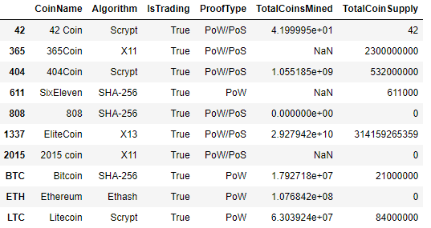

Steps accomplished:
- The following five preprocessing steps have been performed on the crypto_df DataFrame:
    - All cryptocurrencies that are not being traded are removed
    - The IsTrading column is dropped
    - All the rows that have at least one null value are removed
    - All the rows that do not have coins being mined are removed
    - The CoinName column is dropped
- A new DataFrame is created that stores all cryptocurrency names from the CoinName column and retains the index from the crypto_df DataFrame
    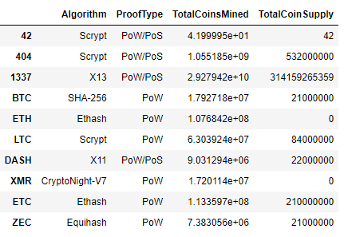 
- The get_dummies() method is used to create variables for the text features, which are then stored in a new DataFrame, "X"
    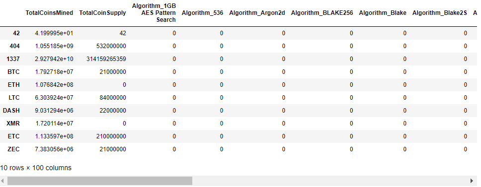
- The features from the X DataFrame have been standardized using the StandardScaler fit_transform() function

 

### Deliverable 2: Reducing Data Dimensions Using PCA
Using the Principal Component Analysis (PCA) algorithm, reduce the dimensions of the X DataFrame to three principal components and place these dimensions in a new DataFrame.

Steps accomplished:
- The PCA algorithm reduces the dimensions of the X DataFrame down to three principal components
- The pcs_df DataFrame is created and has the following three columns, PC 1, PC 2, and PC 3, and has the index from the crypto_df DataFrame

    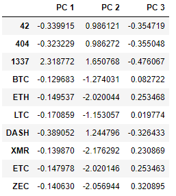

 

### Deliverable 3: Clustering Cryptocurrencies Using K-means
Using the K-means algorithm, create an elbow curve using hvPlot to find the best value for K from the pcs_df DataFrame created in Deliverable 2. Then, run the K-means algorithm to predict the K clusters for the cryptocurrencies’ data.

Steps accomplished:
- The K-means algorithm is used to cluster the cryptocurrencies using the PCA data, where the following steps have been completed:
    - An elbow curve is created using hvPlot to find the best value for K
    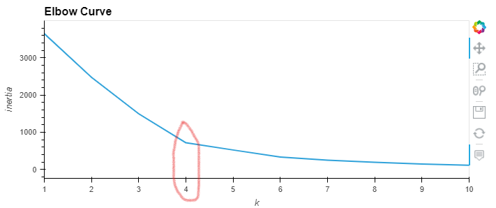
    - Predictions are made on the K clusters of the cryptocurrencies’ data
    - A new DataFrame is created with the same index as the crypto_df DataFrame and has the following columns: Algorithm, ProofType, TotalCoinsMined, TotalCoinSupply, PC 1, PC 2, PC 3, CoinName, and Class
    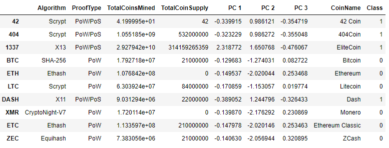

 

### Deliverable 4: Visualizing Cryptocurrencies Results
Using scatter plots with Plotly Express and hvplot, visualize the distinct groups that correspond to the three principal components created in Deliverable 2, then create a table with all the currently tradable cryptocurrencies using the hvplot.table() function.

Steps accomplished:
- The clusters are plotted using a 3D scatter plot, and each data point shows the CoinName and Algorithm on hover
    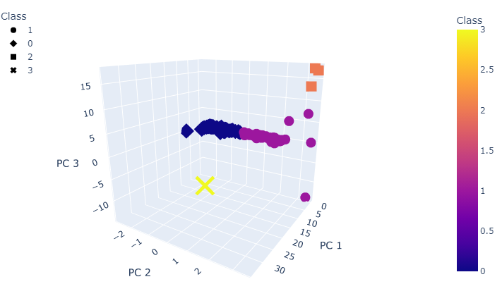 
- A table with tradable cryptocurrencies is created using the hvplot.table() function
    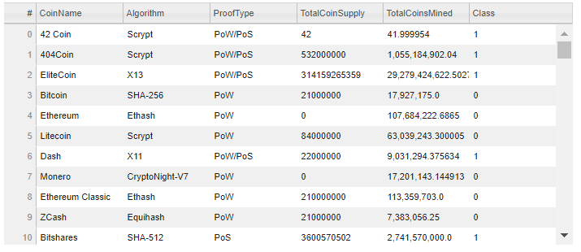
- The total number of tradable cryptocurrencies is printed
    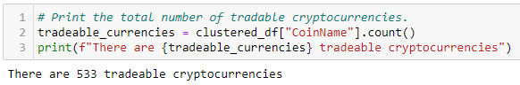
- A DataFrame is created that contains the clustered_df DataFrame index, the scaled data, and the CoinName and Class columns
    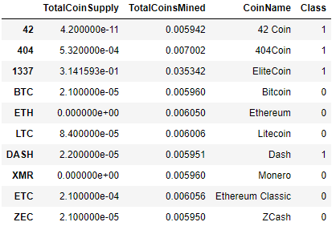
- A hvplot scatter plot is created where the X-axis is "TotalCoinsMined", the Y-axis is "TotalCoinSupply", the data is ordered by "Class", and it shows the CoinName when you hover over the data point
    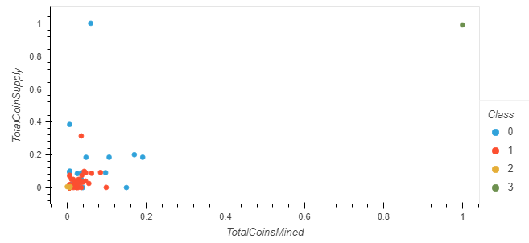